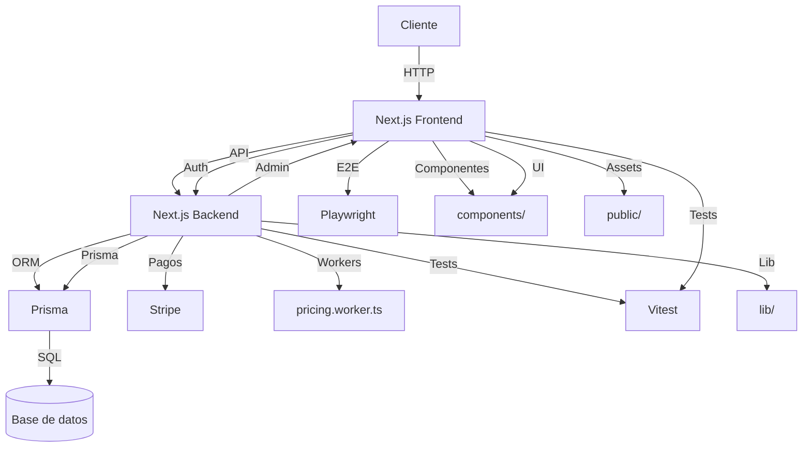

# Ecommerce 3D Print

> Plataforma robusta para venta de productos impresos en 3D, con motor de precios avanzado, panel de administración, integración de pagos, tests automatizados y arquitectura modular.

---

## Tabla de Contenidos
- [Ecommerce 3D Print](#ecommerce-3d-print)
  - [Tabla de Contenidos](#tabla-de-contenidos)
  - [Arquitectura](#arquitectura)
  - [Backend](#backend)
    - [Ejemplo de endpoint](#ejemplo-de-endpoint)
  - [Frontend](#frontend)
  - [Base de datos](#base-de-datos)
  - [Estructura de carpetas](#estructura-de-carpetas)
  - [Comandos útiles](#comandos-útiles)
  - [Variables de entorno](#variables-de-entorno)
  - [Estado del proyecto](#estado-del-proyecto)
  - [Despliegue y recomendaciones](#despliegue-y-recomendaciones)
  - [Contacto](#contacto)
  - [Comandos útiles](#comandos-útiles-1)
  - [Stack](#stack)
  - [Estructura](#estructura)
  - [Variables de entorno](#variables-de-entorno-1)
  - [Estado](#estado)
  - [Contacto](#contacto-1)

---

## Arquitectura



---

## Backend
- **Framework:** Next.js (API routes)
- **Motor de precios:** Algoritmo en `lib/price-calculator.ts` y worker en `workers/pricing.worker.ts`
- **Autenticación:** NextAuth.js
- **Pagos:** Stripe
- **Panel admin:** Rutas protegidas bajo `/app/admin/`
- **Tests:** Vitest (unitarios), Playwright (E2E)

### Ejemplo de endpoint

```http
POST /api/checkout
Content-Type: application/json
{
	"cart": [ ... ],
	"user": { ... }
}
```

---

## Frontend
- **Framework:** Next.js (App Router)
- **UI:** TailwindCSS, componentes en `components/ui/`
- **Estado:** Zustand
- **Internacionalización:** `lib/i18n.ts`, soporte ES/EN
- **Notificaciones:** Toasts (`components/toast-provider.tsx`)
- **Catálogo:** `/app/catalog/`, filtros dinámicos
- **Carrito:** `/app/cart/`, integración con motor de precios
- **Checkout:** `/app/checkout/`, pagos con Stripe

---

## Base de datos
- **ORM:** Prisma
- **Schema:** `prisma/schema.prisma`
- **Migraciones:** `prisma/migrations/`
- **Seed:** `scripts/seed.ts`
- **Modelo principal:** Producto, Usuario, Pedido, Material, Inventario

---

## Estructura de carpetas

```
├── app/                # Rutas, vistas y lógica principal
│   ├── admin/          # Panel de administración
│   ├── cart/           # Carrito
│   ├── catalog/        # Catálogo
│   ├── checkout/       # Checkout
│   ├── product/        # Detalle de producto
│   └── ...
├── components/         # Componentes reutilizables
│   ├── ui/             # Componentes UI (botón, input, etc.)
│   └── ...
├── lib/                # Lógica de negocio y utilidades
├── prisma/             # Migraciones y schema
├── public/             # Assets estáticos
├── scripts/            # Scripts de utilidad
├── workers/            # Web workers (motor de precios)
├── __tests__/          # Tests unitarios e integración
├── e2e/                # Tests E2E
├── private/            # Documentación interna, propuestas, notas
└── ...
```

---

## Comandos útiles

- `yarn dev` — servidor de desarrollo
- `yarn build` — build de producción
- `yarn start` — servidor de producción
- `npx vitest` — tests unitarios e integración
- `npx playwright test` — tests E2E
- `yarn prisma migrate dev` — migraciones
- `yarn prisma db seed` — seed de datos
- `yarn prisma studio` — interfaz gráfica de BD

---

## Variables de entorno
Ver `.env.example` para configuración. Variables principales:
- `DATABASE_URL` — conexión a base de datos
- `STRIPE_SECRET_KEY` — clave de Stripe
- `NEXTAUTH_URL` — URL base para autenticación

---

## Estado del proyecto
- Tests unitarios: Vitest (100% verde, sin advertencias)
- Tests E2E: Playwright (100% verde, sin advertencias)
- Linter: ESLint (sin errores ni advertencias)
- Rama principal: main (desarrollo directo, sin ramas extra)

---

## Despliegue y recomendaciones
- Ignora carpetas: `node_modules`, `.next`, `__tests__`, `e2e`, `private`, `playwright-report`, `test-results`, `logs`, `.env*`, `.vscode`, `.idea`, `.DS_Store`, etc.
- Solo sube a producción: `app/`, `components/`, `lib/`, `prisma/`, `public/`, `workers/`, `package.json`, `next.config.js`, `tsconfig.json`, etc.
- Revisa dependencias y scripts antes de deploy.
- Usa `yarn build` y `yarn start` para producción.

---

## Contacto
Para dudas o soporte, consulta la documentación interna o contacta al equipo.

## Comandos útiles

- `yarn dev` — servidor de desarrollo
- `yarn build` — build de producción
- `yarn start` — servidor de producción
- `npx vitest` — tests unitarios e integración
- `npx playwright test` — tests E2E

## Stack
- Next.js
- TypeScript
- Prisma
- Stripe
- Zustand
- Vitest
- Playwright

## Estructura
- `app/` — rutas, vistas y lógica principal
- `components/` — componentes reutilizables
- `lib/` — lógica de negocio y utilidades
- `prisma/` — migraciones y schema
- `__tests__/` — tests unitarios e integración
- `e2e/` — tests E2E
- `workers/` — web workers

## Variables de entorno
Ver `.env.example` para configuración.

## Estado
- Tests unitarios: Vitest (100% verde, sin advertencias)
- Tests E2E: Playwright (100% verde, sin advertencias)
- Linter: ESLint (sin errores ni advertencias)
- Rama principal: main (desarrollo directo, sin ramas extra)

## Contacto
Para dudas o soporte, consulta la documentación interna o contacta al equipo.

